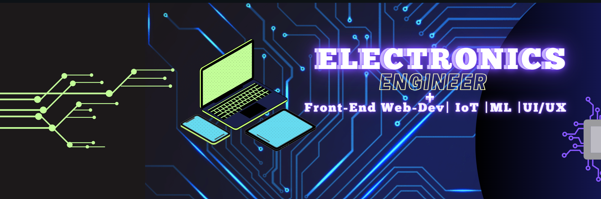

<p align="center"> 
   <!-- <a href="#"> </a>-->
   <a href="#"> </a>
   
  <h1 align="center">Hi , I'm Midhun </h1>
  <h3 align="center">I'm an Electronics Engineering student and a Passionate Developer  </h3>

## 🙋‍♂️ About Me
- 💡 I’m an **Electronics and Communication Engineering** Student 
- 🔐 I’m currently self learning **Machine Learning** & **Cybersecurity** 
- 💻 I like **IoT**,**Embeded Systems**,**Web Deisgn** and **Frontend Development**
- 🏎️ I love to make projects which includes **Hardware and Software**
<!--- 👯 I’m looking to collaborate on **OpenSource Projects**-->
- 👨‍💻 Some of my electronics projects are available at **[My Portfolio](https://memidhun.github.io/Portfolio/)**
- 🎹  I do **Music Production** as my Hobby

## 🚀 Top Languages and Tools:


<!--<p align="left"> <b><u>Skills</p>-->

- **Languages**
    
    
    
    
    
    


- **Front-End Development**

   
   
   
   
    


- **Cloud Hosting**

    
    
    
  


- **Softwares Development Tools** 

    
    
    
- **Hardware Development Tools** 

    
    
    
    
    
- **Extras**:
    
    
    
    
        

<!-- [](#)  [](#) [](#) [](#) [](#) -->

## <b> Github Stats : </b>
   <a href="https://github.com/memidhun/github-readme-stats"></a>
   
   <b>Note:</b> Top languages is only a metric of the languages my public code consist of 
  <a href="https://github.com/memidhun/github-readme-stats"></a>
  
  <br/>

### My Best Projects are still private repos which I can't share for now , Contact me to know more about them
  ### Fun Fact: I once solved the world's oldest question with a single line of JavaScript 😉
<!-- wi*quL3fcV -->

```javascript
// Which came first: the chicken or the egg?
console.log(['🥚', '🐣', '🐥', '🐔'].sort())

>>> [ '🐔', '🐣', '🐥', '🥚' ]
```

## 🫱🏼‍🫲🏼 Connect with me:

<p align="left">

<a href = "https://www.linkedin.com/in/midhunmathew2002"></a>
<a href = "https://www.instagram.com/me_midhun/"></a>
</p>

## ❤ Views and Followers

<a href="https://github.com/Meghna-DAS/github-profile-views-counter">
    </a>
<a href="https://github.com/memidhun?tab=followers"></a>


<!--OLD README IS HERE -->

<!--<p align="center"> -->
   <!-- <a href="#"> </a>-->
<!--   <a href="#"> </a>-->
   
<!--  <h1 align="center">Hi , I'm Midhun </h1>-->
<!--  <h3 align="center">I'm an Electronics Engineering student + a Passionate Developer  </h3>-->

<!--## 🙋‍♂️ About Me-->
<!--- 💡 I’m an **Electronics and Communication Engineering** Student -->
<!--- 🔐 I’m currently learning **Machine Learning** & **Cybersecurity** -->
<!--- 💻 I like **IoT**,**Embeded Systems**,**Web Deisgn** and **Frontend Development**-->
<!--- 🏎️ I love to make projects which includes **Hardware and Software**-->

<!--- 👯 I’m looking to collaborate on **OpenSource Projects**-->

<!--- 👨‍💻 Some of my electronics projects are available at **[My Portfolio](https://memidhun.github.io/)**-->

<!--- 🎹  I do **Music Production** as my Hobby-->

<!--## 🚀 Top Languages and Tools:-->

<!--<div align="center">-->
<!--  <a href="https://www.python.org" target="_blank" style="padding-right: 10px;">-->
<!--    -->
<!--  </a>-->
<!--  <a href="https://getbootstrap.com" target="_blank" style="padding-right: 10px;">-->
<!--    -->
<!--  </a>-->
<!--  <a href="https://www.java.com" target="_blank" style="padding-right: 10px;">-->
<!--    -->
<!--  </a>-->
<!--  <a href="https://www.w3.org/html/" target="_blank" style="padding-right: 10px;">-->
<!--    -->
<!--  </a> -->
<!--  <a href="https://www.w3schools.com/css/" target="_blank" style="padding-right: 10px;">-->
<!--    -->
<!--  </a> -->
<!--  <a href="https://developer.mozilla.org/en-US/docs/Web/JavaScript" target="_blank" style="padding-right: 10px;">-->
<!--    -->
<!--  </a> -->
<!--  <a href="https://www.w3schools.com/c/index.php" target="_blank" style="padding-right: 10px;">-->
<!--    -->
<!--  </a> -->
<!--  <a href="https://nodejs.org" target="_blank" style="padding-right: 10px;">-->
<!--    -->
<!--  </a> -->
<!--  <a href="https://www.arduino.cc/" target="_blank" style="padding-right: 10px;">-->
<!--    -->
<!--  </a>-->
<!--  <a href="https://www.intel.com/content/www/us/en/products/details/fpga/development-tools/quartus-prime.html" target="_blank" style="padding-right: 10px;">-->
<!--    -->
<!--  </a> -->
<!--  <a style="padding-right: 10px;">-->
<!--    -->
<!--  </a>-->
<!--</div>-->

<!-- [](#)  [](#) [](#) [](#) [](#) -->
<!--<br/>-->

<!--</p>-->

<!--<p align="left"> <b><u>Skills</p>-->

<!--- **Languages**-->
    
<!--    -->
<!--    -->
<!--    -->
<!--    -->
<!--    -->


<!--- **Front-End Development**-->

<!--   -->
<!--   -->
<!--   -->
<!--   -->
<!--    -->


<!--- **Cloud Hosting**-->

<!--    -->
<!--    -->
<!--    -->
<!--  -->


<!--- **Softwares Development Tools** -->

<!--    -->
<!--    -->
<!--    -->
<!--- **Hardware Development Tools** -->

<!--    -->
<!--    -->
<!--    -->
<!--    -->
    
<!--- **Extras**:-->
    
<!--    -->
<!--    -->
<!--    -->
<!--        -->

<!--</p>-->

<!--<br>-->


<!--## <b> Github Stats : </b>-->
<!--   <a href="https://github.com/memidhun/github-readme-stats">
<!--   src="https://github-readme-stats.vercel.app/api?username=memidhun&show_icons=true&count_private=true&theme=tokyonight&hide_border=true&bg_color=0D1117" /></a>-->
   
<!--   <b>Note:</b> Top languages is only a metric of the languages my public code consist of -->
<!--  <a href="https://github.com/memidhun/github-readme-stats"></a>-->
  
<!--  <br/>-->


